## Hi there 👋

- 💻 My website's [link](https://necofuryai.io/).
- 🔭 I’m currently working as a Software Engineer.

 

## :rocket: Recent Activities

 

 

 

## :pencil2: My Best Skills

 

## :computer: Languages

 

<!-- ## Contest

<be /> -->

## :trophy: Achievements

 

## :snake: :snake: :snake:

<picture>
  <source
    media="(prefers-color-scheme: dark)"
    srcset="https://raw.githubusercontent.com/necofuryai/necofuryai/output/github-contribution-grid-snake-dark.svg"
  />
  <source
    media="(prefers-color-scheme: light)"
    srcset="https://raw.githubusercontent.com/necofuryai/necofuryai/output/github-contribution-grid-snake.svg"
  />
  
</picture>

 

<!--📊

**necofuryai/necofuryai** is a ✨ _special_ ✨ repository because its `README.md` (this file) appears on your GitHub profile.

Here are some ideas to get you started:

- 🔭 I’m currently working on ...
- 🌱 I’m currently learning ...
- 👯 I’m looking to collaborate on ...
- 🤔 I’m looking for help with ...
- 💬 Ask me about ...
- 📫 How to reach me: ...
- 😄 Pronouns: ...
- ⚡ Fun fact: ...
-->
